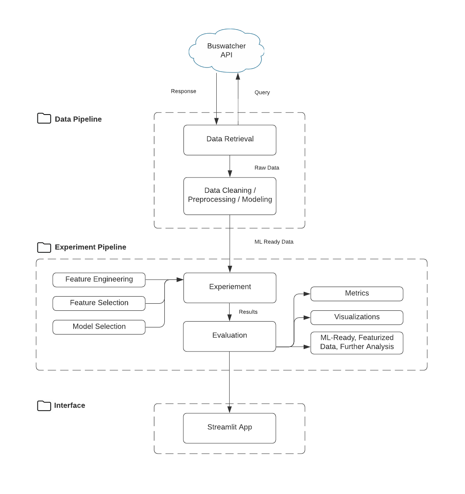

# BusWatcher Insights
**BusWatcher Insights** is an open-source project and [public interface](https://cornell-tech-urban-tech-hub.github.io/buswatcher-insights/) which aims to build a set of tools for analyzing and predicting bus ridership in New York City, powered by [NYCBusWatcher](https://github.com/Cornell-Tech-Urban-Tech-Hub/nycbuswatcher) and other publicly available urban data sources. It is an open-source collaboration between students at Cornell Tech and [the Urban Tech Hub](https://urban.tech.cornell.edu/).

This repository facilitates an end-to-end workflow by providing modular utilities and methods for fetching / processing data, designing / running experiments, and evaluating / visualizing results.

## Setup
1. `conda create -n buswatcher-insights python=3.8`
2. `conda activate buswatcher-insights` 
3. `pip install -r requirements.txt`
4. `conda config --env --add channels conda-forge`
5. `conda config --env --set channel_priority strict`
6. `conda install python=3 geopandas`

## Data Pipeline
Download the [Data](https://drive.google.com/drive/u/1/folders/102oPRwK7Wvy86T9nK6346dxDmLMjhVsQ) folder from Google Drive and store it locally in `data/`. 

Alternatively, you can run the following commands to query, process, and save NYCBusWatcher data directly from the public API (note that the weather data referenced in the Streamlit Interface will still need to be accessed via the Drive link provided above):

1. `python data_pipeline_1.py B46 -m 8 9 -y 2021`. This command will query NYC BusWatcher for minute-by-minute data on the B46 route for August and September, 2021 and save the response as a geojson file in `data/Bus/API Call`
2. `python data_pipeline_2.py B46_2021-10-18.geojson`. This command will filter the data such that each route segment corresponds to at most one observation per unique trip ID and save the filtered data as a csv file in `data/Bus/Segmented Data - Raw`
3. `python data_pipeline_3.py B46_2021-10-18.csv`. This command will perform some additional cleaning / processing on the output of the prior step and save the results in `data/Bus/Segmented Data - Processed`

## Experiment Pipeline
`python run_experiment.py ./data B46 JFK 1 -t 14D -r 1D -n test`. This command will save a train a model based on a feature set and train / test split defined in the main script and save a picked vesion of the inputs required to construct an instance of the Evaluation class (without the -n argument, it would just return the Evaluation instance itself without saving the relevant inputs)

`run_experiment.py`

**Positional Arguments:**
 
  `route`                 The route number, i.e. "B46"
  
  `station`               The weather station, i.e. "JFK"
  
  `direction`             The route direction, i.e. 0 or 1
  
**Optional Arguments:**

  `-h`, `--help`            show this help message and exit
  
  `-r`, `--refit_interval`  Refit interval specified as a pandas timedelta
                        
  `-t`, `--test_period`     Time period for testing specified as a pandas timedelta
                        
  `-n`, `--experiment_name` Experiment name to pickle the eval class in saved experiments
                        

See `notebooks/demo.ipynb` for an example.

## Streamlit Interface
Run streamlit app `streamlit run st_main.py`
